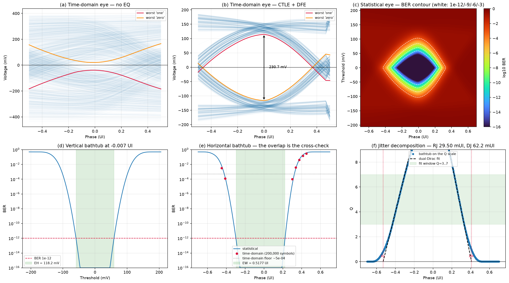
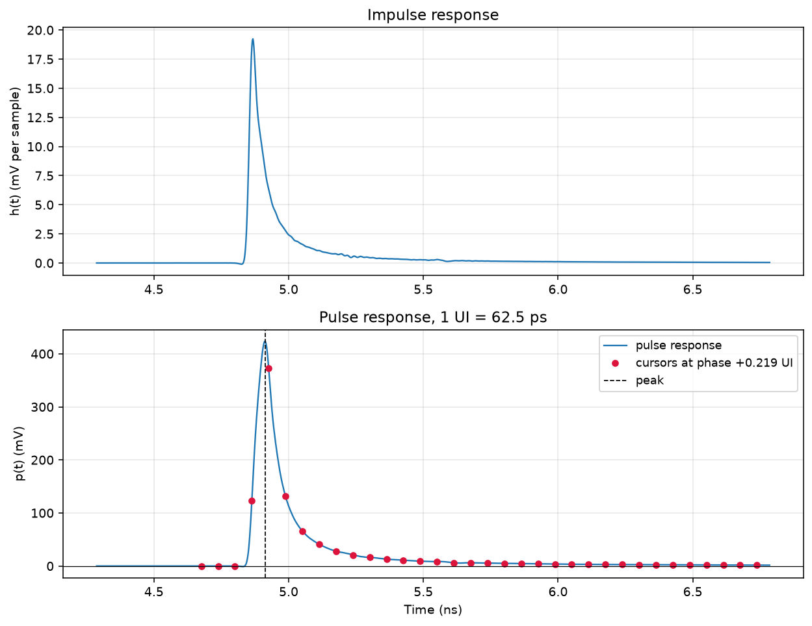
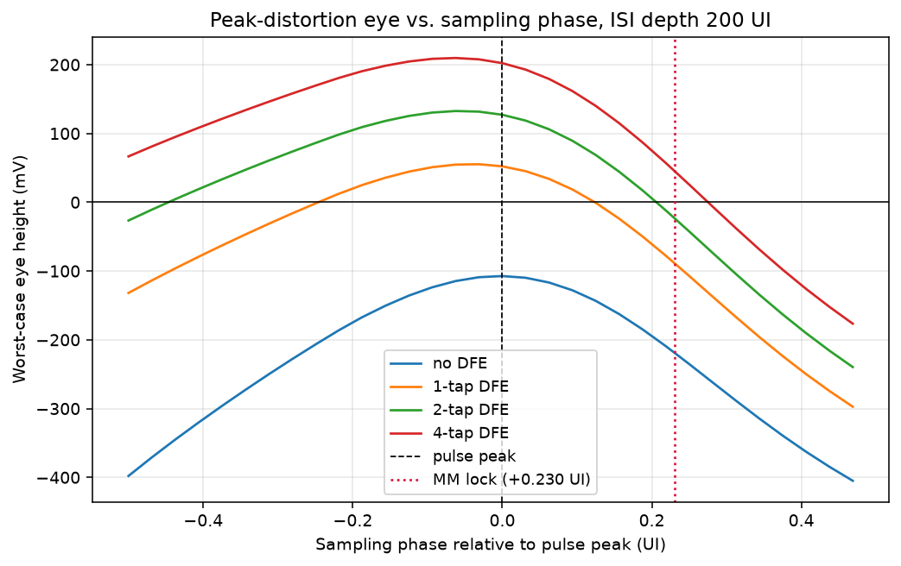
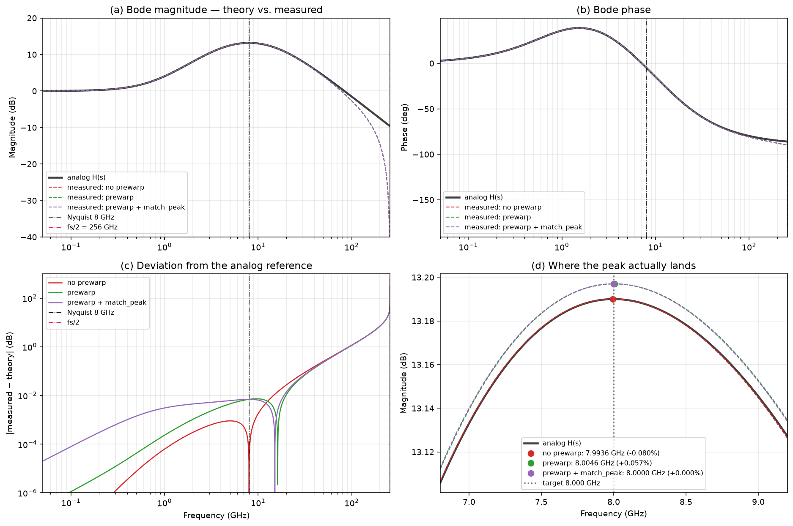
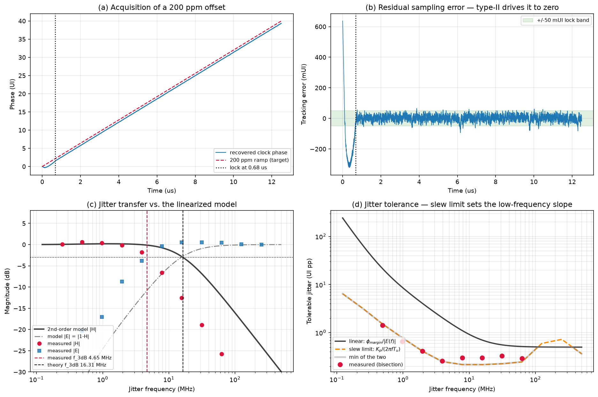

# wireline-link-model

A 16 Gbps NRZ wireline **receiver** link model in Python — CTLE + DFE + CDR over a
measured IEEE 802.3ck backplane channel, with both **time-domain** and
**statistical** simulation and a verification script for every block.

The point of the project is not just to produce an eye diagram. It is to produce
one whose every number can be traced back to a closed-form expression, and to
check it against that expression. Each block ships with a self-test, and each
result below was cross-checked before being quoted.

```
        analog / oversampled  (fs = M x Rs)      |   discrete / baud-rate
                                                 |
  PRBS --> TX --> channel --> CTLE ------------->|--> DFE --> slicer --> bits
           |       (.s4p)     H(s)         ^     |     |         |
           |                               |     |     |         v
           |                          sample     |     +----- decisions
           |                            phase    |               |
           +-------------------------------+-----+----------- CDR (BBPD)
```

The model splits at the sampler: everything to its left is LTI and composes by
multiplying frequency responses; everything to its right involves decisions and
feedback and must be stepped in time.

---

## Headline results

Measured channel: **13.19 dB** insertion loss at the 8 GHz Nyquist frequency,
4.91 ns propagation delay (32 inches of stripline).

| | Before EQ | After CTLE + 2-tap DFE |
|---|---|---|
| Time-domain eye height | **−59.6 mV (closed)** | **+230.7 mV** |
| Worst-case eye (peak distortion, 200 UI) | −107 mV | +127 mV |
| First postcursor `h₁/h₀` | 0.353 | ~0.01 |

**Statistical margin at BER 1e-12: 118.2 mV eye height, 0.518 UI (32.4 ps) eye
width.**



Three findings that came out of the model rather than going into it:

- **The Mueller-Müller CDR locks where the eye is closed.** On the unequalized
  channel it settles at +0.230 UI — forced there because `h₁ = h₋₁` drags the
  sampler late on a channel with a long postcursor tail and almost no
  precursor. That costs 145 mV against the best phase and closes an eye that is
  otherwise open, *even with an ideal 2-tap DFE*. The CTLE fixes it, which makes
  the CDR lock point part of the CTLE design problem rather than a downstream
  detail.
- **Jitter tolerance is slew-rate limited, not error-transfer limited.**
  Measured JTOL sits **15× below** the linear `margin/|E(f)|` prediction and
  within 10% of `K_p/(2π f T_u |H(f)|)`. The linearized loop model simply does
  not describe the low-frequency limit.
- **The measured loop bandwidth is 71% below the linearized prediction** —
  which is the model working, not failing. `f_3dB ∝ K_pd ∝ 1/σ_τ`, so inverting
  the shortfall recovers an effective σ_τ of 0.070 UI against the 0.020 assumed,
  consistent with the 144 mUI of measured dither.

---

## Quick start

Requires Python 3.11+.

```bash
python -m venv .venv
.venv\Scripts\Activate.ps1          # Windows PowerShell
# source .venv/bin/activate         # Linux / macOS

pip install numpy scipy matplotlib scikit-rf control
```

Then fetch the channel data — it is not in the repository:

```bash
# download and extract into channel/  (10 MB, IEEE 802.3ck public materials)
curl -O https://www.ieee802.org/3/ck/public/tools/backplane/palkert_3ck_02_0120.zip
unzip palkert_3ck_02_0120.zip -d channel/
```

See [`channel/README.md`](channel/README.md) for the expected layout. Everything
writes PNGs to `results/`.

```bash
# 1. characterize the channel — run this first, everything derives from it
python scripts/plot_channel.py

# 2. confirm the S-parameter -> pulse response conversion is physical
python scripts/verify_channel.py

# 3. the headline analysis: eyes, BER contour, bathtubs, jitter split
python scripts/analyze_eye.py
```

Every script takes `--config` to select an experiment (`baseline` or `no_eq`)
and `--help` for its options.

```bash
python scripts/analyze_eye.py --taps 1 --sigma-n 15e-3 --rj 0.008
python scripts/verify_cdr.py  --ppm 500 --detector alexander
```

Module self-tests run standalone:

```bash
python -m src.tx      # 37 checks: PRBS period/balance/autocorrelation, edges, FFE
python -m src.ctle    # 21 checks: pole-zero inversion, bilinear warping
python -m src.cdr     # 18 checks: PD truth tables, loop parameters, closed loop
```

---

## Scripts

| Script | What it does | Covers |
|---|---|---|
| `plot_channel.py` | Mixed-mode response, impulse/pulse response, cursors, eye vs. sampling phase | prerequisite |
| `verify_channel.py` | Causality, cursor-sum identity, passivity — 9 checks with numeric tolerances | data validity |
| `verify_ctle.py` | Measured discrete-time CTLE response vs. analog `H(s)`, three discretization modes | criterion 3 |
| `verify_cdr.py` | Frequency-offset acquisition, jitter transfer, jitter tolerance | criterion 3 |
| `analyze_eye.py` | Time-domain eyes, statistical BER contour, bathtubs, RJ/DJ decomposition | criteria 1, 2, 3 |

## Modules

| Module | Responsibility |
|---|---|
| `src/config.py` | `LinkConfig` and nested CTLE/DFE/CDR blocks; every knob carries its bounds |
| `src/params.py` | `Bounded` — a parameter that knows its own admissible range, so a sweep reads its search space off the config |
| `src/configs/` | One module per experiment, selected by name at run time |
| `src/channel.py` | `.s4p` → Sdd21 → impulse → pulse → cursors, plus the self-tests on each step |
| `src/analog.py` | Cascading LTI blocks in the frequency domain |
| `src/ctle.py` | `H(s) = A_dc(1+s/ω_z)/((1+s/ω_p1)(1+s/ω_p2))`, pole/zero inversion, bilinear with prewarping |
| `src/tx.py` | PRBS7–31, NRZ waveform, finite rise/fall, 2-tap FFE |
| `src/cdr.py` | Alexander and Mueller-Müller detectors, type-II digital loop filter, phase interpolator |
| `src/sim_stat.py` | Statistical eye: ISI distribution, BER contour, bathtubs, dual-Dirac fitting |
| `src/plotting.py` | All matplotlib output — nothing else in `src/` writes to disk |

---

## Example results

### Channel and equalization

The pulse response has a long, slowly decaying tail: 20 UI of postcursors
captures only 86% of the ISI, and cursor +100 is still 0.21 mV. `isi_depth` is
therefore 200, not a round number chosen for convenience.



### Where the CDR samples matters

Worst-case eye against sampling phase for several DFE tap counts. The dotted
line is where a Mueller-Müller CDR actually locks on the unequalized channel —
right where the 2-tap curve crosses zero.



### CTLE, measured against theory

The discrete-time filter is measured by pushing an impulse through the same
`lfilter` path the time-domain engine uses, then compared with the analog
`H(s)`. With peak matching the peak lands at 8.000 GHz (0.0000% error) and the
boost within +0.053%.



### CDR

Acquires a 200 ppm offset in 0.68 µs. Panel (d) is the jitter-tolerance result:
measurement follows the slew bound, far below the linear prediction.



---

## Documentation

The `docs/` directory carries the reasoning, not just the results.

| Document | Contents |
|---|---|
| [`spec.md`](docs/spec.md) | Link specification, measured channel, success criteria, open items |
| [`architecture.md`](docs/architecture.md) | Module decomposition and the sampler split |
| [`notes.md`](docs/notes.md) | **Why this architecture** — one page, the argument for CTLE + DFE + CDR |
| [`ctle_notes.md`](docs/ctle_notes.md) | Transfer function, boost, peaking frequency — full derivations |
| [`dfe_notes.md`](docs/dfe_notes.md) | Postcursor cancellation, tap derivation, why ZF ≡ MMSE for feedback taps |
| [`cdr_notes.md`](docs/cdr_notes.md) | BBPD linearization, jitter transfer, bandwidth and damping |
| [`statopt_review.md`](docs/statopt_review.md) | Design patterns borrowed from the StatOpt statistical tool |

---

## Validation

Every block ships a self-test, and the two simulation methods are checked
against each other where both can resolve a BER.

| Check | Result |
|---|---|
| Impulse response DC self-test, `Σh = H(0)` | 2.2e-16 |
| Cursor sum identity, `Σ cursors = H(0)`, all 32 phases | 2.3e-16 |
| Isolated TX symbol vs. `channel.pulse_response` | 8.3e-17 |
| CTLE measured impulse vs. `freqz` coefficients | 3.1e-14 |
| PRBS7–31 period = 2ⁿ−1, balance, autocorrelation | exact |
| CDR lock phase vs. analytic prediction | 0.56 PI steps |
| **Statistical vs. time-domain BER, overlap region** | **0.90× geometric mean** |

That last row is the one that matters: agreement in the range both methods can
resolve is what licenses extrapolating the statistical curve down to 1e-12.

The channel file itself carries one flaw worth knowing about — its DC row is
synthesized rather than measured (imaginary parts ~1e-19) and is marginally
non-passive, σ_max = 1.057. Every measured point is passive. `verify_channel.py`
reports it as a warning rather than a failure, since no change to this code can
fix it.

---

## Assumptions and limitations

Stated up front, because margin numbers are only meaningful alongside them.

- **No crosstalk.** 802.3ck links are crosstalk-limited in practice, so every
  margin here is optimistic by an amount this model does not estimate. The NEXT
  and FEXT aggressors are present in `channel/` if you want to quantify it —
  this is the single most valuable extension.
- **Ideal TX.** No TX FFE by default; `src/tx.py` implements one, but enabling
  it is a deliberate departure from the documented architecture.
- **Correct decisions.** Both engines assume the DFE never makes an error, so
  error propagation is excluded from both. The bound `|w₁| ≤ 0.5` is enforced as
  a reported flag, not a model.
- **Noise is a stand-in.** The default 10 mV rms stands in for receiver noise
  *plus* an allowance for the crosstalk that is not modelled. Vertical margin
  scales roughly inversely with it.
- **Single channel.** One backplane, no sweep across cases.
- **Statistical assumes independent cursors**, which is exact for the linear
  chain and false once the DFE and CDR are in the loop — see the discussion at
  the top of `scripts/analyze_eye.py` for which method to trust when.

---

## Channel data

The S-parameters are **not stored in this repository** — they are contributed
materials of the IEEE P802.3ck task force, so they are downloaded from the
source. One archive, 10 MB:

**[`palkert_3ck_02_0120.zip`](https://www.ieee802.org/3/ck/public/tools/backplane/palkert_3ck_02_0120.zip)**
→ extract into `channel/`

That gives four backplane cases (16+16, 8+24, 5+27, 4+28 inch splits), each with
a THRU channel plus three NEXT and four FEXT aggressors. Every result here uses
the 16+16 inch THRU. See [`channel/README.md`](channel/README.md) for the
expected layout, the accompanying IEEE presentation, and what the aggressor
files are good for.
